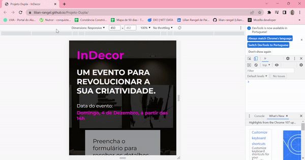

<h1 align="center">Projeto Landing Page</h1>  

Quinto projeto da Mentoria Conquiste sua Vaga entregue num prazo de 10 dias, realizado em dupla por Lílian Rangel e Santiago Barreto  

O objetivo era vivenciarmos o dia a dia mais realista de um desenvolvedor ao trabalhar com mais pessoas num projeto. 

<h2 align="center">Aprendizados nesse projeto 🎯</h2>
Com esse projeto aprendemos um pouco mais sobre a criação de um projeto do zero, comandos GIT (como branch checkout, merge), responsividade com uso de media queries e  adicionar gif ao README.  
Além de como é importante trabalhar em equipe, algo que levaremos para a nossa vida como desenvolvedores.

<h2 align="center">Tecnologias utilizadas 🛠</h2> 

<h2 align="center">Deploy 👨🏽‍💻</h2>
<a href="https://lilian-rangel.github.io/Projeto-Dupla/" target="_blank">Confira a nossa landing page nesse link</a>

<h2 align="center">Prints da página</h2>
 

<h2 align="center">Página Responsiva para mobile</h2>

<h2 align="center"> Contributors 💻</h2>
<table align="center">
<tbody>
<tr>
<td align="center">
<a href="https://github.com/lilian-rangel" rel="nofollow"> <b>Lilian Rangel</b></a>
</td>
<td align="center">
<a href="https://github.com/SanX0000" rel="nofollow"> <b> Santiago Barreto  </b></a>
</td>
</tr>
</tbody>
</table>
